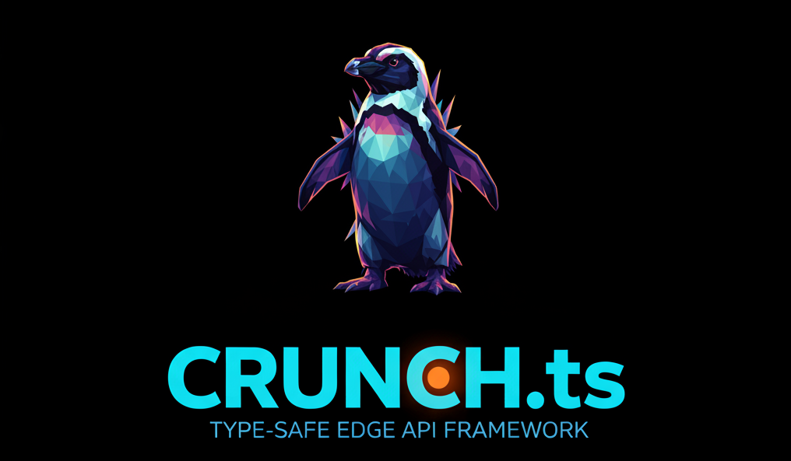

# CRUNCH.ts - Type-safe API framework for Edge Functions.

It provides a unified interface for both **JSON-RPC** and standard **HTTP** services, with automatic
type validation, JWT authentication, and a fully standalone, type-safe generated client.

---

## Quick Start

### 1. Initialize your project

```bash
mkdir my-api && cd my-api
pnpm init
pnpm add github:thomkin/crunch.ts.git
```

### 2. Configure CRUNCH.ts

Create a `crunchy.json` file in your root directory to define where your services live:

```json
{
  "serviceDirectories": ["src/services"],
  "clientOutDir": "dist/client"
}
```

### 3. Create your first service

Create `src/services/ping.ts`:

```typescript
import { ServiceDefinition } from "global-message-service/types";

export interface Request {
  message: string;
}

export interface Response {
  reply: string;
}

export const service: ServiceDefinition<Request, Response> = {
  method: "system.ping",
  isPublic: true,
  handler: async (input) => {
    return { reply: `Pong! You said: ${input.message}` };
  },
};
```

### 4. Build and Run

Add the build scripts to your `package.json` to trigger the CRUNCH.ts build pipeline:

```bash
  pnpm add -D tsx typescript cross-env ts-patch vitest
```

```json
"scripts": {
  "build": "cross-env CRUNCH_CFG=./crunchy.json pnpm run node_modules/crunch.ts/build",
}
```

Then run:

```bash
pnpm run build
```

---

## Features

- 🚀 **Built for Edge functions** — frame work to implement complex APIs in a single edge script / edge function.
  - should work on deno and bun setups. Platforms that support the fetch api should be able to run it.
- 🛠 **Type Safety with Typia** — automatic runtime request validation generated at build time
- 🔐 **JWT Auth** — built-in authentication and permission-based authorisation
- 📡 **Dual Protocol** — standard HTTP routes (`GET /users/:id`) _and_ a single `/rpc` endpoint for RPC-style calls
- 📦 **Standalone Generated Client** — create a client that can be used in any typescript app.

---

## Project Structure

```
crunchy.ts
├── src/
│   ├── types/
│   │   └── service.ts     ← Core type definitions (ServiceDefinition, RpcResponse, …)
│   ├── router/
│   │   ├── rpc.ts         ← RPC request router
│   │   └── http.ts        ← HTTP request router
│   ├── auth/
│   │   └── jwt.ts         ← JWT sign / verify helpers
│   └── handler.ts         ← Main entry point (dispatches RPC vs HTTP)
├── scripts/
│   ├── buildRegistry.mts  ← Step 1: generates build/generated/registry.ts
│   ├── build.mts          ← Step 3: bundles for into a single javascript file (dist/index.js)
│   └── buildClient.mts    ← Step 4: generates the standalone consumer client
├── build/
│   ├── generated/
│   │   ├── registry.ts    ← AUTO-GENERATED — service registry with Typia validators
│   │   ├── types.ts       ← AUTO-GENERATED — all client-facing types (no src imports)
│   │   └── client.ts      ← AUTO-GENERATED — type-safe consumer client
│   └── tsc/               ← TypeScript compiler output
├── dist/
│   └── index.js           ← Final edge bundle (minified ESM)
└── package.json
```

---

## Build Pipeline

The full build is made up of **four sequential steps**. Run them all at once with:

```bash
pnpm run build
```

### Step 1 — Generate the Service Registry

```bash
pnpm run build:registry
```

**What it does:**  
`scripts/buildRegistry.mts` scans `{crunchy.json.serviceDirectories}/` recursively for every `.ts`
file (excluding `.test.ts` files). For each discovered service it generates an import and a Typia
validation wrapper. The output is written to `build/generated/registry.ts`.

**Output:** `build/generated/registry.ts`

> **Why this step must run first:** The RPC router (`src/router/rpc.ts`) imports from `@generated/registry` (aliased to `build/generated/registry.ts`). If this file does not exist, the TypeScript compilation in Step 2 will fail.

---

### Step 2 — Compile TypeScript

```bash
pnpm run build:ts
```

**What it does:**  
Runs `tsc -p tsconfig.json`. Compiles everything in `src/`, `scripts/`, and `build/generated/` to `build/tsc/`. This also applies the `ts-patch` + `typia` transformer that rewrites `typia.assert<T>(...)` calls into efficient runtime validators.

> **Note:** `ts-patch install -s` must run before this step (handled automatically by `npm run build`).

**Output:** `build/tsc/` — compiled `.js` and `.d.ts` files for the entire project.

---

### Step 3 — Bundle for the Edge

```bash
pnpm run build:edge
```

**What it does:**  
`scripts/build.mts` uses `esbuild` to bundle `build/tsc/src/index.js` into a single minified ESM file. The `@generated/registry` alias is resolved to the compiled registry. The target is `browser` (matching the Web Worker-like Bunny.net environment).

**Output:** `dist/index.js` — the final edge-deployable bundle.

---

### Step 4 — Generate the Standalone Consumer Client

```bash
pnpm run build:client
```

**What it does:**  
`scripts/buildClient.mts` uses the **TypeScript Compiler API** to:

1. Scan `crunchy.json.serviceDirectories` and parse each service file
2. Build a `ts.Program` containing all service files plus `src/types/service.ts`
3. For each service, locate the exported `Request` and `Response` type symbols via the type checker
4. Recursively walk all transitive type references (other interfaces, enums, type aliases) that are defined in the local `src/` tree
5. Re-print each declaration with `ts.createPrinter`, renaming them to `Req_N` / `Res_N` to avoid collisions
6. Merge in the client-visible shared types (`RpcResponse`, `RpcErrorCode`, `HttpMethod`) from `src/types/service.ts`
7. Write everything into a single `build/generated/types.ts` with **no `import` statements** — fully self-contained
8. Generate `build/generated/client.ts` that imports only from `'ky'` and `'./types'`
9. Clean up any stale copied `.ts` files from previous builds

**Output:**

| File                        | Description                                                                         |
| --------------------------- | ----------------------------------------------------------------------------------- |
| `build/generated/types.ts`  | All `Request`/`Response` types + `RpcResponse`/`RpcErrorCode` — no external imports |
| `build/generated/client.ts` | Hierarchical type-safe client — imports only `ky` and `./types`                     |

**The client and types files together are fully standalone**

---

## Adding a New Service

### 1. Create the service file

Create a new `.ts` file anywhere under `{crunchy.json.serviceDirectories}`. The method name becomes the namespace hierarchy in the generated client.

**Example RPC service** — `src/services/messages/send.ts`:

```typescript
import { ServiceDefinition, RpcContext } from "../../types/service";

// Define the request shape
export interface Request {
  to: string;
  body: string;
  priority?: "low" | "normal" | "high";
}

// Define the response shape
export interface Response {
  messageId: string;
  sentAt: string;
}

export const service: ServiceDefinition<Request, Response> = {
  method: "messages.send", // Dot-separated → client.rpc.messages.send(...)
  isPublic: false, // Requires a valid JWT if set to true, in this case its a public route
  requiredPermission: "send_messages", // Required permission defined in the JWT toke payload a name permisson:{name:"boolean"}
  handler: async (input: Request, ctx: RpcContext): Promise<Response> => {
    return {
      messageId: crypto.randomUUID(),
      sentAt: new Date().toISOString(),
    };
  },
};
```

**Example HTTP service** — `src/services/messages/list.ts`:

```typescript
import { ServiceDefinition } from "../../types/service";

export interface Request {
  limit?: number;
}

export interface Response {
  messages: Array<{ id: string; body: string }>;
}

export const service: ServiceDefinition<Request, Response> = {
  method: "messages.list", // → client.crud.messages.list(...)
  httpMethod: "GET",
  path: "/messages",
  isPublic: false,
  handler: async (input, ctx) => {
    return { messages: [] };
  },
};
```

### 2. Rebuild

```bash
npm run build
```

Or, if you only need to update the client (e.g. you are iterating on types during frontend development):

```bash
npm run build:registry && npm run build:client
```

The new service is automatically discovered — no manual registration needed.

### 3. Use the updated client

```typescript
import { init } from "./build/generated/client";

const client = init({
  baseUrl: "https://your-edge.bunny.net",
  token: "jwt...",
});

// RPC
const result = await client.rpc.messages.send({
  to: "user@example.com",
  body: "Hello!",
});
console.log(result.result?.messageId);

// HTTP
const list = await client.crud.messages.get({});
console.log(list.messages);
```

---

## Using the Client as an npm Package

The two files `build/generated/client.ts` and `build/generated/types.ts` are designed to be **shipped directly to consumers**. They have no dependency on the server source code and only require the `ky` HTTP library at runtime.

### Option A — Copy files directly

Copy `client.ts` and `types.ts` into your consumer project's source tree. Both files are plain TypeScript with a single runtime dependency:

```bash
npm install ky
```

### Option B — Auto-sync during development

Set `CLIENT_OUT_DIR` to automatically copy the generated files to your frontend project on every `npm run build:client`:

```bash
CLIENT_OUT_DIR=../my-frontend/src/api npm run build:client
```

---

## Environment Variables

| Variable     | Required  | Description                                                                                                          |
| ------------ | --------- | -------------------------------------------------------------------------------------------------------------------- |
| `JWT_SECRET` | ✅ Server | Secret key for signing and verifying JWT tokens. This must be set in the edge script frameworks evniroment variables |

---

## Error Handling

All responses — both RPC and HTTP — use a consistent JSON envelope:

```typescript
{
  result?: T;         // Present on success
  error?: number | string;   // Present on failure (RpcErrorCode or string)
  message?: string;   // Human-readable error description
}
```

### RPC Error Codes (`RpcErrorCode`)

| Code  | Name              | Meaning                                       |
| ----- | ----------------- | --------------------------------------------- |
| `100` | `InvalidRequest`  | Request is not a valid JSON object            |
| `101` | `InvalidMethod`   | `method` field is missing or not a string     |
| `102` | `MethodNotFound`  | No service registered for that method name    |
| `103` | `Unauthorized`    | Token missing or expired                      |
| `104` | `Forbidden`       | Token valid but missing required permission   |
| `105` | `ValidationError` | Request params failed Typia schema validation |
| `500` | `InternalError`   | Unhandled exception in the handler            |

### Throwing from a Handler

```typescript
handler: async (input, ctx) => {
  if (!input.id) {
    throw new Error("ID is required"); // → InternalError 500
  }
  // Auth and validation errors are handled automatically by the router
};
```

---

## Protocol Reference

### RPC — `POST /rpc`

```json
// Request
{
  "method": "health.isAlive",
  "params": { "ping": "hello" },
  "token": "optional-jwt"
}

// Success response
{ "result": { "pong": "hello", "timestamp": "2026-03-15T07:00:00.000Z" } }

// Error response
{ "error": 103, "message": "Authentication token required" }
```

## Current Limitations

1. **JSON only** — both protocols currently only support JSON payloads
2. **Wildcard routing** — wildcards are simple prefix matches (`/api/*` matches everything starting with `/api/`)
3. **Single edge bundle** — everything is bundled into `dist/index.js`; large dependency graphs which could increase cold-start times
